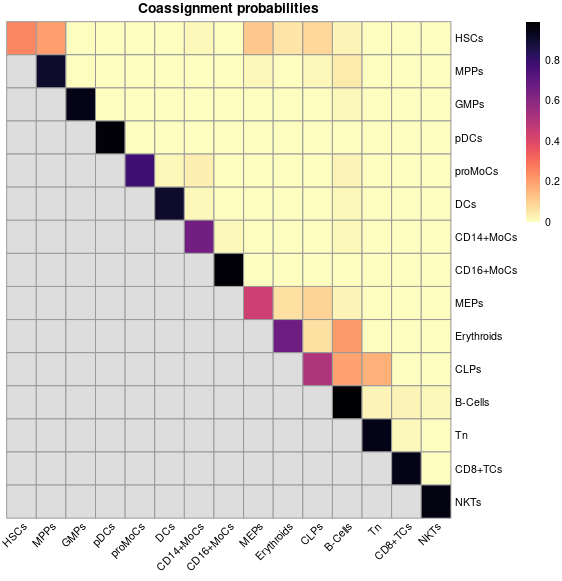

# BootStrapSC 

## Bootstrap Cluster Stability Analysis for Single-Cell Data

[](https://github.com/PrashINRA/BootStrap_SingleCell)
[](https://opensource.org/licenses/MIT)

Single-cell clusters are mathematical constructs while cell types are biological truth. There must be a consensus between biology and mathematics to interpret single-cell clusters. **BootStrapSC** evaluates the quality and stability of your single-cell clusters by measuring how consistently cells reassemble into the same groups under bootstrap perturbation.

Overlapping clusters may also reveal cellular hierarchies (e.g., hematopoietic stem cells showing overlap with other progenitor cells), making this tool useful for unraveling biological relationships encoded in your data.

---

## Installation

```r
# Install devtools if you don't have it
install.packages("devtools")

# Install BootStrapSC from GitHub
devtools::install_github("PrashINRA/BootStrap_SingleCell")
```

---

## Quick Start

```r
library(BootStrapSC)

# Set Idents to your cell type annotation (skip this if you want to test seurat_clusters directly)
Idents(seu) <- "cell_type"

# Run bootstrap stability analysis (uses active Idents by default)

coassign <- bootstrap_clusters(seurat_obj,
                                reduction = "pca", #Or supply any dim red you used e.g- ICA or NMF
                                dims = 1:30,
                                resolution = 0.3, #Choose the resolution you used for clustering
                                iterations = 50)

# Plot the co-assignment heatmap
plot_coassignment(coassign)
```

That's it. 

---

## Usage

### `bootstrap_clusters()`

The main function. Feed it a processed Seurat object and it handles everything.

```r
coassign <- bootstrap_clusters(
  seurat_obj,
  clusters   = NULL,         # Default: uses active Idents
  reduction  = "pca",        # Any reduction in your object: "pca", "nmf", "mnn", etc.
  dims       = 1:30,         # change it if you have used less or more dims for original clustering
  resolution = 0.3,          # Clustering resolution (match your original analysis)
  algorithm  = 1,            # 1=Louvain, 2=Louvain refined, 3=SLM, 4=Leiden((match your original analysis))
  n.cells    = NULL,         # Default: total number of cells (full bootstrap)
  iterations = 50,           # Number of bootstrap iterations
  verbose    = TRUE          # Progress messages
)
```

**Custom cluster labels:** You can pass any cluster or cell type annotation.

```r
# Use a custom annotation instead of seurat_clusters
coassign <- bootstrap_clusters(seurat_obj,
                                clusters = seurat_obj$cell_type,
                                reduction = "nmf",
                                dims = 1:15,
                                resolution = 0.5)
```

### `plot_coassignment()`

Visualize the results as a heatmap.

```r
# Basic plot
plot_coassignment(coassign)

# With probability values displayed
plot_coassignment(coassign, display_numbers = TRUE)

# With hierarchical clustering to group similar clusters
plot_coassignment(coassign, cluster_rows = TRUE, cluster_cols = TRUE)

# Custom title
plot_coassignment(coassign, title = "AML - Cluster Stability")
```

---

## How It Works

### Bootstrap Resampling

In each iteration, the function draws a sample of `n.cells` cells **with replacement** from the full dataset. With full-size resampling, roughly ~63% of unique cells appear per resample (some multiple times), while the rest are left out. This creates a meaningful perturbation of the original data.

To handle the fact that Seurat objects cannot hold cells with duplicate barcodes, the function clusters only the unique cells in each resample and maps results back to the full bootstrap sample via index matching. This preserves correct frequency counts while avoiding object duplication errors.

### Independent Reclustering

The bootstrap sample is reclustered from scratch using the same parameters you specify (reduction, dims, resolution). This reclustering is completely independent of the original labels.

### Co-assignment Scores

After reclustering, a contingency table is built: rows are original cluster identities, columns are new cluster assignments. Each row is normalized to sum to 1, producing a **spread vector** that describes where cells from a given original cluster ended up.

The co-assignment score between two clusters is the **dot product** of their spread vectors. Since each vector sums to 1, the Cauchy-Schwarz inequality guarantees scores are bounded between 0 and 1.

### Handling Missing Clusters

Small clusters may be absent from some bootstrap samples. The function tracks valid iterations per cluster pair and averages only over iterations where both clusters were present, preventing bias from missing data.

---

## Interpreting the Output



- **Diagonal values** = cluster self-stability. Near 1 means the cluster consistently reconstitutes itself. Low values indicate instability or many overlapping gene programmes between cell types.

- **High off-diagonal values** = cells from two clusters frequently intermix after reclustering. This suggests either: (a) resolution is too high and the clusters should be merged, or (b) genuine biological overlap exists (e.g., a differentiation continuum).

- **Low off-diagonal values** = clusters are well separated and robust.

---

## Parameter Guidance

| Parameter | Recommendation | Notes |
|-----------|---------------|-------|
| `reduction` | Match your analysis | Use whatever reduction your original clustering was based on |
| `dims` | Match your analysis | Same dimensions as your original `FindNeighbors` call |
| `resolution` | Match your analysis | Same resolution as your original `FindClusters` call |
| `n.cells` | `ncol(seurat_obj)` (default) | Full-size bootstrap. ~63.2% unique cells per resample |
| `iterations` | 50-100 | More iterations = smoother estimates, longer runtime |

---

## Requirements

- R (>= 4.0)
- [Seurat](https://satijalab.org/seurat/) (>= 4.0.0)
- [pheatmap](https://cran.r-project.org/package=pheatmap)
- [viridis](https://cran.r-project.org/package=viridis)

---

## Citation

If you use BootStrapSC in your research, please cite:

> Singh, P. & Zhai, Y. (2022). Deciphering Hematopoiesis at single cell level through the lens of reduced dimensions. *bioRxiv*. doi: [10.1101/2022.06.07.495099](https://doi.org/10.1101/2022.06.07.495099)

---

## License

MIT License. See [LICENSE.md](LICENSE.md) for details.
