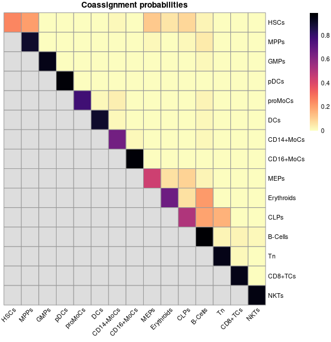

# BootStrapSC 

## Bootstrap Cluster Stability Analysis for Single-Cell Data

[](https://github.com/PrashINRA/BootStrap_SingleCell)
[](https://opensource.org/licenses/MIT)

Single-cell clusters are mathematical constructs while cell types are biological truth. There must be a consensus between biology and mathematics to interpret single-cell clusters. **BootStrapSC** evaluates the quality and stability of your single-cell clusters by measuring how consistently cells reassemble into the same groups under bootstrap perturbation.

Overlapping clusters may also reveal cellular hierarchies (e.g., hematopoietic stem cells showing overlap with progenitor cells), making this tool useful for unraveling biological relationships encoded in your data.

---

## Installation
```r
# Install devtools if you don't have it
install.packages("devtools")

# Install BootStrapSC from GitHub
devtools::install_github("PrashINRA/BootStrap_SingleCell")
```

---

## Quick Start
```r
library(BootStrapSC)

# Run bootstrap stability analysis (uses active Idents by default)
coassign <- bootstrap_clusters(seurat_obj,
                                reduction = "pca",
                                dims = 1:30,
                                resolution = 0.3,
                                iterations = 50)

# Plot the co-assignment heatmap
plot_coassignment(coassign)
```

That's it. Two functions, direct output.

---

## Usage

### `bootstrap_clusters()`

The main function. Feed it a processed Seurat object and it handles everything.
```r
coassign <- bootstrap_clusters(
  seurat_obj,
  clusters   = NULL,         # Default: uses active Idents
  reduction  = "pca",        # Any reduction in your object: "pca", "nmf", "mnn", etc.
  dims       = 1:30,         # Dimensions to use from the reduction
  resolution = 0.3,          # Clustering resolution (see calibration below)
  algorithm  = 1,            # 1=Louvain, 2=Louvain refined, 3=SLM, 4=Leiden
  n.cells    = NULL,         # Default: total number of cells (full bootstrap)
  iterations = 50,           # Number of bootstrap iterations
  verbose    = TRUE          # Progress messages
)
```

**Custom cluster labels:** You can pass any cluster or cell type annotation.
```r
# Use a custom annotation instead of seurat_clusters
coassign <- bootstrap_clusters(seurat_obj,
                                clusters = seurat_obj$cell_type,
                                reduction = "nmf",
                                dims = 1:15,
                                resolution = 0.5)
```

### `plot_coassignment()`

Visualize the results as a heatmap.
```r
# Basic plot
plot_coassignment(coassign)

# With probability values displayed
plot_coassignment(coassign, display_numbers = TRUE)

# With hierarchical clustering to group similar clusters
plot_coassignment(coassign, cluster_rows = TRUE, cluster_cols = TRUE)

# Custom title
plot_coassignment(coassign, title = "AML - Cluster Stability")
```

---

## How It Works

### Bootstrap Resampling

In each iteration, the function draws a sample of `n.cells` cells **with replacement** from the full dataset. With full-size resampling, roughly 63.2% of unique cells appear per resample (some multiple times), while the rest are left out. This creates a meaningful perturbation of the original data.

To handle the fact that Seurat objects cannot hold cells with duplicate barcodes, the function clusters only the unique cells in each resample. This preserves correct frequency counts while avoiding object duplication errors.

### Independent Reclustering

The bootstrap sample is reclustered from scratch using the same parameters you specify (reduction, dims, resolution). This reclustering is completely independent of the original labels.

### Pairwise Co-assignment (Monti et al. 2003)

After reclustering, a contingency table is built: rows are original cluster identities, columns are new cluster assignments. Co-assignment is computed **per iteration** using a label-agnostic pairwise approach:

- **Self-stability (cluster A vs itself):** What fraction of within-cluster cell pairs land in the same recluster? Computed as `sum(choose(n_per_recluster, 2)) / choose(n_total, 2)`.

- **Cross-assignment (cluster A vs B):** What fraction of cross-cluster cell pairs land in the same recluster? Computed as `sum(n_A_per_recluster * n_B_per_recluster) / (n_A * n_B)`.

This approach is **label-agnostic**: it does not matter if recluster "3" in iteration 1 corresponds to recluster "5" in iteration 2. Only co-occurrence within the same recluster matters. This avoids the label permutation problem that compresses scores when using spread-vector dot-product methods.

### Handling Missing Clusters

Small clusters may be absent from some bootstrap samples. The function tracks valid iterations per cluster pair and averages only over iterations where both clusters were present, preventing bias from missing data.

---

## Interpreting the Output



- **Diagonal values** = cluster self-stability. Near 1 means the cluster consistently reconstitutes itself. Low values indicate instability.

- **High off-diagonal values** = cells from two clusters frequently intermix after reclustering. This suggests either: (a) resolution is too high and the clusters should be merged, or (b) genuine biological overlap exists (e.g., a differentiation continuum).

- **Low off-diagonal values** = clusters are well separated and robust.

---

## Parameter Guidance

| Parameter | Recommendation | Notes |
|-----------|---------------|-------|
| `reduction` | Match your analysis | Use whatever reduction your original clustering was based on |
| `dims` | Match your analysis | Same dimensions as your original `FindNeighbors` call |
| `resolution` | Calibrate (see below) | May differ from your original resolution |
| `n.cells` | `ncol(seurat_obj)` (default) | Full-size bootstrap. ~63.2% unique cells per resample |
| `iterations` | 50-100 | More iterations = smoother estimates, longer runtime |

### Important: Calibrating the Resolution Parameter

Both `reduction` and `dims` must exactly match your original analysis. However, `resolution` often needs recalibration. Here is why:

Bootstrap resampling produces subsets with only ~63% of your original cells. At the same resolution, this smaller dataset may yield fewer clusters than your full dataset. If you manually merged clusters or annotated cell types after initial clustering, the mismatch can be even larger. When the bootstrap produces fewer clusters than your original annotation, multiple cell types collapse into the same recluster, and co-assignment values become compressed and uninformative.

**Solution:** Test on a simulated bootstrap subsample to find the resolution that recovers the correct number of clusters:
```r
set.seed(42)
chosen <- sample(ncol(seu), ncol(seu), replace = TRUE)
sub <- seu[, unique(chosen)]
sub <- FindNeighbors(sub, reduction = 'pca', dims = 1:30, verbose = FALSE)

for (res in seq(0.1, 1.0, by = 0.1)) {
  sub <- FindClusters(sub, resolution = res, verbose = FALSE)
  k <- length(unique(sub$seurat_clusters))
  message(paste0("Resolution: ", res, " -> ", k, " clusters"))
}
```

Choose the resolution that gives a cluster count closest to your number of cell types/groups. For example, if you have 7 annotated cell types and resolution 0.3 gives 6 clusters on the subsample but 0.4 gives 7, use `resolution = 0.4` in `bootstrap_clusters()`.

---

## Requirements

- R (>= 4.0)
- [Seurat](https://satijalab.org/seurat/) (>= 4.0.0)
- [pheatmap](https://cran.r-project.org/package=pheatmap)
- [viridis](https://cran.r-project.org/package=viridis)

---

## Citation

If you use BootStrapSC in your research, please cite:
```
Singh, P. & Zhai, Y. (2022). Deciphering Hematopoiesis at single cell level
through the lens of reduced dimensions. bioRxiv.
doi: 10.1101/2022.06.07.495099

https://github.com/PrashINRA/BootStrap_SingleCell
```

---

## License

MIT License. See [LICENSE.md](LICENSE.md) for details.